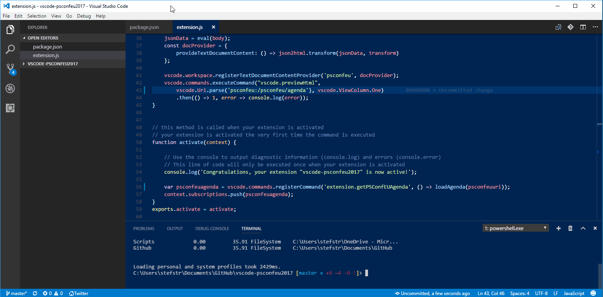

# Visual Studio Code PSConfEU Agenda extension

This extension shows the PSConfEU Agenda for 2017 within VSCode.
You can find more information about the [PowerShell Conference EU 2017](http://www.psconf.eu/).

This extension is a submission for the Agenda Competition! 
[Details...](http://www.powertheshell.com/agendacompetition)

## Features

This extension shows the PSConfEU Agenda for 2017 within VSCode. 

## Requirements

This VSCode does not need any extra requirements.

## Extension Settings

There are not extension settings needed to configure.

## Known Issues

There are no know issues at the moment. 

## Release Notes

### 1.0.0

Initial release of PSConfEU 2017 VSCode extension.

### 1.0.1

Updated README.md file. Image was not being shown.

### 1.0.2

Small changes

-----------------------------------------------------------------------------------------------------------
